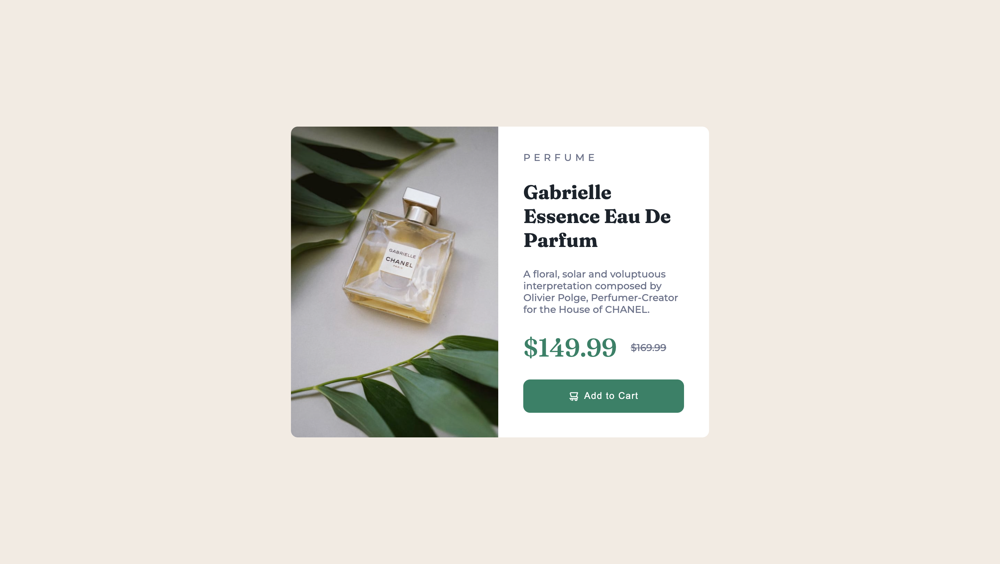

# Frontend Mentor - Product preview card component solution

This is a solution to the [Product preview card component challenge on Frontend Mentor](https://www.frontendmentor.io/challenges/product-preview-card-component-GO7UmttRfa). Frontend Mentor challenges help you improve your coding skills by building realistic projects. 

## Table of contents

- [Overview](#overview)
  - [The challenge](#the-challenge)
  - [Screenshot](#screenshot)
  - [Links](#links)
- [My process](#my-process)
  - [Built with](#built-with)
  - [What I learned](#what-i-learned)
  - [Continued development](#continued-development)
  - [Useful resources](#useful-resources)
- [Author](#author)

## Overview

### The challenge

Users should be able to:

- View the optimal layout depending on their device's screen size
- See hover and focus states for interactive elements

### Screenshot

**Desktop screenshot**

**Mobild screenshot**


### Links

- Solution URL: [Add solution URL here](https://github.com/lij110397/product-preview-card-component)
- Live Site URL: [Add live site URL here](https://lij110397.github.io/product-preview-card-component/)

## My process

### Built with

- Semantic HTML5 markup
- CSS custom properties
- Flexbox
- CSS Grid
- Mobile-first workflow

### What I learned
**1. How to use preprocessor like SaSS**
- Define variables
```sass
$primary-color: #3498db;
```
- Define mixin
- Define combined rules 
However, in this case, I don't think it is necessary to use SaSS, since there are limited variables.
**2. How to add strikethrough**
```css
.strikethrough-text {
  text-decoration: line-through;
}
```
**3. How to add a responsive picture**
The image source will change according to the media scale, instead of simply switching the size of image.
<source> only indicate the source of the image. But most of css styles are still changed by 
```html
<picture class="product-image">
        <source media="(max-width: 43rem)" srcset="images/image-product-mobile.jpg" />
        <source media="(min-width: 43rem)" srcset="images/image-product-desktop.jpg" />
        
</picture>
```
This can match with media queries. The image will change and some other styles.
```css
@media (min-width: 43rem)
```

### Continued development
**try to use flex and grid to change the layout and use no media queries at all.**

### Useful resources

- [Resource 1](https://www.youtube.com/watch?v=p3_xN2Zp1TY&ab_channel=KevinPowell) - This helped me understand how to build responsive layout without using media queries.

## Author

- Website - Jiao Li
